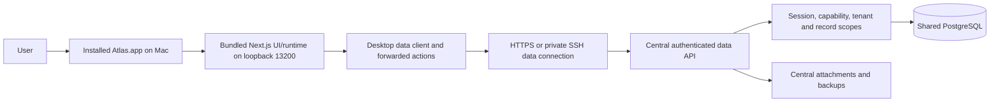
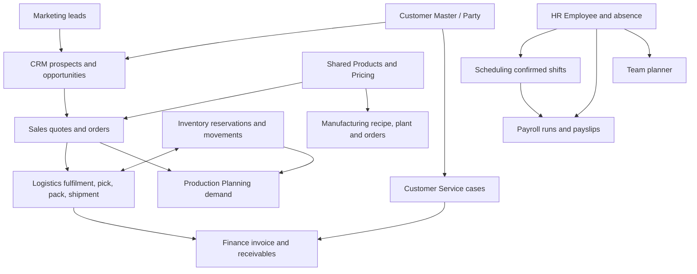

# Atlas technical system wiring and verification guide

Inspected: **4 October 2026**. Scope: current working-tree source, schema, build scripts and recorded release evidence. This is a connection map and acceptance checklist, not certification that every feature is live. The working tree contains concurrent uncommitted changes; installed Mac and central service releases may differ from it. No business records were changed for this document.

## 1. How to use this document

Start with the runtime diagram, then find the relevant module and cross-module connection. Test both ends using the same organisation and record IDs. A visible Apps tile proves navigation, not the downstream workflow. Mark a connection complete only after an authorised user saves in the installed app, reopens the record from the central service, and an unauthorised profile is rejected.

Evidence levels used here: **source** means implementation inspected; **recorded** means prior verification described in `.ai/CURRENT_STATE.md`; **pending** means this task did not execute live acceptance. All new live checks in the acceptance tables remain pending.

## 2. Runtime and deployment topology

The approved boundary puts screens and application runtime on the Mac, and authoritative business records, attachments and backups on the server. The data service is API-only. Its code still includes persistence commands and business validation; this diagram does not establish an independent audit of the precise permitted service/runtime split. There is no approved local business database or offline fallback. Explicit user-chosen CSV exports are permitted.

| Connection | Implementation to inspect | Contract / failure point |
|---|---|---|
| Native app → local UI | `desktop/macos/Atlas.swift` | Bundled runtime; installed target `/Users/michael/Applications/Atlas.app` |
| Local query → central data | `src/core/db/client.ts`, `src/core/desktop/data-client.ts` | `ATLAS_RUNTIME=desktop` selects remote read proxy; missing connection fails |
| Local save → central command | `scripts/prepare-runtime.mjs`, `scripts/generate-data-api.mjs` | Build inserts action forwarding into exported server actions; compatible server action registry required |
| Session | `src/core/auth/session.ts`, `src/app/api/desktop/session/route.ts` | Server resolves authenticated user, organisation and capabilities; desktop does not hold database credentials |
| Read endpoint | `src/app/api/desktop/query/route.ts`, `src/server/data-api/read-query.ts` | Read-method allowlist; scoped nested relations; protected fields removed/masked |
| Write endpoint | `src/app/api/desktop/action/route.ts`, `src/server/data-api/action-registry.ts` | Registered action only; authenticated except the explicit sign-in, sign-out and setup-code allowlist; each command must enforce its own authority |
| Query model authority | `src/server/data-api/read-policy.ts`, `model-metadata.ts` | Every new model and relation needs correct capability and scope coverage |
| Wire encoding | `src/core/desktop/wire.ts` | Round-trip non-plain JSON values and action arguments |
| Release | `scripts/build-mac-client.sh`, `install-mac-client.sh`, `deploy-mac-client.sh` | Schema compatibility, isolated package, release locks, preserved prior app |

The `X-Atlas-Client` header identifies the protocol and is not authentication. Session and server-side checks are the security boundary. Generic read RPC cannot create/update/delete; desktop raw SQL and local transactions throw. Read methods include find, count, groupBy and aggregate. The source read planner defaults findMany to 5,000 rows and limits nested list projections to 500: reporting and selectors must account for limits and pagination.

## 3. Core identities and shared records

| Shared identity / platform object | Used by | Wiring requirement |
|---|---|---|
| Organisation | Every tenant module | Resolve from session and enforce on server queries/commands, including linked records |
| User, membership, role | Login, company settings, profiles, all modules | Capabilities and data scopes govern access; role name alone is not authority |
| ModuleState | Apps, launcher, dependency checks | Both `enabled` and `entitled` must be true |
| Party | Customer Master, CRM, Sales, Finance, Service, Projects, Marketing links | Reuse canonical customer/company/person identity, contacts and addresses |
| Product | Products, Pricing, Sales, Inventory, Planning, Manufacturing, Logistics | Shared product ID, units, physical measures, recipe and commercial classification |
| Employee | HR, Scheduling, Payroll, Team planner, goals and Safety | Reuse HR identity; employee/user linkage matters for self-service |
| Warehouses and locations | Inventory, Logistics and production stock operations | Central stock ownership and valid location IDs; no module-specific second balance |
| Audit/activity/outbox | Commands and oversight | Change evidence and durable event record are different from successful downstream delivery |

The authoritative entity/foreign-key definitions are `prisma/schema.prisma`. Appendix B inventories every declared model relation in the inspected schema. Scalar source IDs/JSON payload references require service inspection as well; a schema relation alone does not establish an executing handoff.

## 4. Module registration and navigation

The sole catalogue is `src/core/modules/registry.ts`. `types.ts` defines integration contracts and `runtime.ts` filters enabled, entitled and accessible modules. `launcherVisible:false` deliberately hides Products from the main launcher while preserving its routes. A manifest status of available/installed is source metadata, not a live release result. Quality and Fleet are the remaining catalogue stubs after registry filtering; Purchasing is owned by Finance.

The following table is extracted from current manifest files. Quality has an available manifest file but is not imported into the inspected registry, which still uses its stub; this is a confirmed registration mismatch. Dependencies are enablement prerequisites, not a complete list of all records a module can read.

| Module ID | Root route | Declared dependencies | Source status |
|---|---|---|---|
| `analytics` | `/analytics` | None | available |
| `audit` | `/audit` | None | available |
| `crm` | `/crm/today` | None | installed |
| `finance` | `/finance` | None | available |
| `kpis` | `/kpis` | None | available |
| `logistics` | `/logistics` | stock | available |
| `manufacturing` | `/manufacturing` | stock, products | available |
| `marketing` | `/marketing` | None | available |
| `payroll` | `/payroll` | people, scheduling | available |
| `people` | `/people` | None | available |
| `plan` | `/plan` | None | available |
| `planning` | `/planning` | stock, sales | available |
| `pricing` | `/pricing` | None | available |
| `products` | `/products` | None | available |
| `projects` | `/projects` | None | available |
| `quality` | `/quality` | None | available |
| `safety` | `/safety` | people | available |
| `sales` | `/sales/orders` | None | available |
| `scheduling` | `/scheduling` | people | available |
| `service` | `/service` | None | available |
| `stock` | `/stock` | None | available |
| `teams` | `/teams` | people | available |

## 5. Business workflow connections

Arrows above summarise business relationships; the table below identifies the actual mechanism and its acceptance limit. It does not imply every arrow is asynchronous automation.

| Connection | Actual mechanism / key source | What must be checked |
|---|---|---|
| Customer → CRM / Sales | Party relations; CRM prospect/opportunity services; `src/modules/sales/services/queries.ts` | Conversion reuses customer identity; authorised rep visibility; contact/address selection retains the right account |
| Products / Pricing → Sales | `src/core/pricing/`, `src/core/products/`, Sales composer and commercial services | Customer hierarchy pricing, agreement, currency, VAT, pack/unit and discount; quote-to-order preserves terms |
| Sales → Logistics | `src/core/logistics/handoff.ts` → manifest `salesLogisticsConsumer` → `src/modules/logistics/services/demand.ts` | Confirmed order produces correct active lines; holds/cancellation propagate; warehouse resolution works; disabled Logistics causes handoff to return |
| Logistics → Sales status | `fulfilmentProjectionProvider`; `shippedQuantityForLine()` | Ordered/allocated/shipped/delivered quantities reconcile; shipped line cannot be incorrectly cancelled |
| Inventory ↔ Logistics | Stock manifest `stockProvider`; Logistics reservation/movement requests; `stockReplenishedConsumer` | No duplicate reservation/movement on retry; balancing shortages releases the right demand |
| Delivery → Finance | `src/core/finance/handoff.ts` → `deliveryInvoiceConsumer` → `finance/services/delivery-invoice.ts` | Correct delivered quantity, delivery invoice date, payment-term due date and idempotency; disabled Finance returns without invoicing |
| Sales ↔ Finance | `src/core/finance/connections.ts`; source, projection, invoice-generator and cancellation-guard manifest hooks | Finance document points to order/line; credit and cancellation controls retain existing accounting links |
| Purchase receipt → Inventory | Stock `financeReceiptConsumer:receiveFinanceGoods` | Receipt increases stock once; purchasing and warehouse identities match |
| HR expenses → Finance | People `expensePostingSourceProvider`; `src/core/finance/expense-source.ts` | Only approved claim can post; amount/payee/currency and retry behaviour reconcile |
| Sales + Inventory → Production Planning | Sales `planningDemandProvider`; Stock `planningInventoryProvider`; `src/core/planning/` | Same product IDs; active confirmed demand and physical stock; plan intentions are not stock receipts |
| Product recipe → Manufacturing | `products/services/make.ts`; Manufacturing plant, commands, MRP, scheduler and forecast services | Recipe version/component quantities, work centre/machine, production order and completion; full manufacturing coverage remains separately open |
| Shared availability → quote/order supply dates | `src/core/availability/picture.ts`, `stock-promise.ts`; Sales supply notes | Stock/forecast promise matches planning; forecast quantity is not available physical stock |
| HR recruitment → onboarding; learning/documents → employee | `people/platform-actions.ts`; HR platform queries and registers | Same-company employee identity, accepted offer, matching email, onboarding permission, version/audit; own-learning scope and expiry filters |
| HR ↔ Scheduling | Shared Employee, RotaShift and absence; scheduling planner/services | Approved leave blocks appropriate shifts; draft vs confirmed/published shift; profile shows permitted rota |
| HR + Scheduling → Payroll | `src/modules/payroll/services/commands.ts`; payroll domain calculations | Confirmed overtime, approved statutory/unpaid absence, holiday and employee tax settings; calculation is not HMRC submission |
| HR → Team planner | `src/modules/teams/services/queries.ts`, `commands.ts`; Planner relations | People picker uses HR Employee; scope/cover/task assignment; empty HR data means empty roster |
| HR / goals / work → My work | `src/app/(app)/profile/page.tsx`, `profile/work.ts`; HR self-service | User-to-employee link, own records only, assigned work, payslip capability |
| Service → Finance credit | `src/modules/service/services/commands.ts`; Finance connections/actions | Approved case credit links customer and original invoice; internal ticket completion does not silently resolve customer case |
| Marketing → CRM | `src/modules/crm/services/marketing-handoff.ts`; Marketing commands and lead records | Qualification/claim workflow; scoring crossing writes MQL/outbox; do not assume an installed automatic event consumer |
| Projects → customer/work surfaces | Project services and `customerOverviewProvider` | Customer relation, private/team/project record access, assigned tasks and documents |
| Plan → actuals and shared work | `src/modules/plan/services/`; scoped saved plans | Private until shared; actuals read source records; Plan `/plan` is separate from production workbench `/planning` |
| Source modules + selected Plans → S&OP | `businessPlanningProvider`, `core/planning/business-read.ts`, `modules/sop/` | Module-owned tenant/capability projections; immutable versions retain source IDs, reasons, revisions and access requirements; 42 authenticated live acceptance checks passed; advanced coverage explicit in `SOP.md` |
| Approved S&OP → Manufacturing MRP | `planningPublicationConsumer`, `ManufacturingDemandForecast.sourceSopVersionId` | Transactional/idempotent approved monthly totals; subtract gross booked demand once, add remaining firm demand; screen/calculation demand paths net once; current-month/retry/overlapping-cycle acceptance passed |
| Safety → people/equipment/delivery context | Safety services and `src/core/safety/types.ts` | Training/permit/equipment risk restrictions and actual consumer registration; a declared optional hook is not proof of implementation |
| Goals → source results | Optional analytics `goalQuery` on source-owned metrics; `src/modules/kpis/services/read-measure.ts` | Bounded goal dates, source capabilities/entitlements, tenant scopes; rates and current positions compare to full target. See `docs/modules/GOALS_KPIS.md`. |
| Analytics → module metrics | `src/core/analytics/catalogue.ts`, `load.ts`; module `analyticsProvider` | Only enabled/accessible metrics; source record scopes and drilldowns; private dashboard ownership |
| Audit / Echo / chat → business records | `src/core/audit/`, `src/core/chat/`; Audit module | Actor and record visibility; mentions/links must not grant recipient access to restricted records |

## 6. Provider registry: what is actually plugged in

Each manifest below supplies these hooks. Omitted optional hooks do not acquire an implementation merely because `ModuleManifest` declares the type.

| Module | Hooks present in manifest |
|---|---|
| analytics | None |
| audit | `attentionProvider` |
| crm | `analyticsProvider`, `attentionProvider`, `crmCustomerOverviewProvider`, `customerOverviewProvider`, `salesAttentionProvider`, `salesSearchProvider`, `searchProvider` |
| finance | `analyticsProvider`, `customerOverviewProvider`, `deliveryInvoiceConsumer`, `salesCancellationGuard`, `salesFinanceProjectionProvider`, `salesInvoiceGenerator`, `searchProvider` |
| csat | `analyticsProvider`, `serviceSurveyConsumer` |
| kpis | `analyticsProvider` |
| logistics | `analyticsProvider`, `attentionProvider`, `customerOverviewProvider`, `fulfilmentProjectionProvider`, `salesLogisticsConsumer`, `searchProvider`, `stockReplenishedConsumer` |
| manufacturing | `analyticsProvider`, `attentionProvider`, `searchProvider`, `businessPlanningProvider`, `planningPublicationConsumer`, `recordContextProvider`, `recordRelationshipProvider` |
| marketing | `analyticsProvider`, `attentionProvider`, `customerOverviewProvider`, `searchProvider` |
| payroll | None |
| people | `analyticsProvider`, `attentionProvider`, `expensePostingSourceProvider`, `peopleAttentionProvider`, `staffRosterProvider` |
| plan | `attentionProvider`, `searchProvider` |
| planning | `analyticsProvider` |
| pricing | `analyticsProvider` |
| products | `analyticsProvider` |
| projects | `analyticsProvider`, `attentionProvider`, `customerOverviewProvider`, `searchProvider` |
| quality | None |
| safety | `attentionProvider`, `safetyProvider`, `searchProvider` |
| sales | `analyticsProvider`, `customerOverviewProvider`, `planningDemandProvider`, `salesCustomerOverviewProvider`, `salesFinanceSourceProvider` |
| scheduling | `analyticsProvider` |
| service | `analyticsProvider`, `attentionProvider`, `customerOverviewProvider`, `searchProvider` |
| stock | `analyticsProvider`, `financeReceiptConsumer`, `planningInventoryProvider`, `stockProvider` |
| teams | `attentionProvider`, `searchProvider` |

## 7. Events, reliability and silent skips

`src/core/events/bus.ts` provides an in-process awaited emitter. Defining an event name or calling emit does not connect a consumer. A source search for `on(DOMAIN_EVENTS...)` / literal named-event subscriptions found no registrations during this inspection. Explicit provider handoffs are therefore the important executing links to inspect.

Sales confirmation writes a transactional DomainOutbox record and separately calls the Logistics handoff after confirmation. Marketing qualification and Logistics milestones also write outbox records. No outbox dispatcher was established by this inspection; previous architecture evidence records that dispatcher/consumer work remains open. Durable pending events do not prove retry/delivery. Check what happens if a downstream handoff fails after the upstream transaction has committed, and whether backfill/retry creates duplicates.

Two confirmed source behaviours need particular attention: disabled/unentitled Logistics makes the Sales handoff return; disabled/unentitled Finance makes the delivered-invoice handoff return. Module-state monitoring and reconciliation must distinguish intentional disablement from an unexpectedly missing invoice/fulfilment.

## 8. Connection acceptance checklist

All entries below are **pending live verification in this documentation task**. Use isolated authorised test records; record environment, app/service release identifiers, organisation, actor, upstream/downstream IDs, expected versus actual result and cleanup. Keep private customer data and credentials out of shared memory.

| Test | Pass evidence |
|---|---|
| Installed app → server | Launch installed Atlas; local screen opens; authenticated central record read succeeds; data-service failure shows an error |
| Login/session | Login/logout/password recovery as applicable; expired/missing session rejected; no signed-in data persists after quit |
| Module activation | Entitled + enabled + prerequisites + role capability + correct launcher/navigation; direct URL is still checked |
| New model/action | Model read policy and generated relation metadata present; forwarded action registered in compatible central service |
| Tenant/profile isolation | Foreign-company IDs, related records, protected HR/bank fields and restricted project/case records rejected or removed |
| Customer and prices | Existing Party/contact/address selected; hierarchy pricing/terms apply; quote conversion preserves relationship |
| Commercial delivery | Confirm order → allocate → release → scan/pick → pack → dispatch → deliver; all line quantities reconcile |
| Finance integration | One correctly linked draft invoice for delivered quantity; due date follows payment terms; repeat delivery/retry does not duplicate |
| Holds/shortages/cancellation | Credit hold blocks intended release; stock replenishment balances correct line; shipped/invoiced cancellation guard works |
| Inventory receipt/transfer | Purchase receipt and warehouse transfer reconcile source/destination balances and immutable movement evidence |
| Manufacturing | Recipe and plant lookup → production order → scheduled work → completion; verify actual stock/costing effects rather than assume |
| HR planning | Approved holiday/absence → availability; shift create/edit/reopen/publish; monthly totals and self-profile |
| Payroll | Same employee has confirmed overtime, approved sickness and holiday; payslip lines reconcile; own-payslip isolation |
| Team planner | Existing HR person → team → task/cover/handover; manager/staff scopes; shared organisation contains Employee rows |
| Service / Marketing / Projects | Case-credit workflow; lead qualification/claim; customer/project/task links and private/team access |
| Insights and audit | Customer overview, search, attention and Analytics agree with source records and permissions; audit shows correct actor |
| Retry and outage | Break downstream connection after upstream save; reopen and reconcile; recovery is explicit and idempotent |

Recommended check entry points: `scripts/check-release-schema.mjs` (central schema compatibility), `scripts/check-installed-pages.mjs` (read-only installed route checks), `tests/desktop-data-integration.test.ts`, `desktop-required-relations.test.ts`, `company-user-isolation.test.ts`, `finance-wire.test.ts`, `logistics.test.ts`, `stock-balance.test.ts`, `planning-inventory.test.ts`, `workforce-time.test.ts` and the relevant module tests. These are pointers, not test results from this task.

For application changes run appropriate lint/type/tests plus the required production build, then the compatible desktop and data-service release steps, activate for intended profiles and verify installed use. A documentation-only change does not require restarting the user's app.

## 9. Confirmed findings and evidence limits

- **Quality registration gap:** `src/modules/quality/manifest.ts` exists with available status, but the inspected registry does not import it and retains qualityStub. Source foundation presence does not make that implementation reachable as a registered available app.

- Current source registers 21 implemented manifests and retains Quality/Fleet stubs. Older architecture/module prose describing Payroll, Logistics, Manufacturing or Safety as wholly planned is stale; this guide follows the registry and preserves historical delivery evidence as historical.
- Products explicitly has `launcherVisible:false`; an absent Products launcher tile alone is not a missing registration.
- Module access, submenu access and data-model access are separate gates. Payroll/HR/KPIs can use `core.profile.self` for entry while sensitive pages need additional capabilities.
- Optional provider declarations are broader than actual manifest registrations. Manufacturing/Payroll/Teams do not currently contribute analyticsProvider hooks; Safety does not register a safetyProvider in its manifest. This is a wiring observation, not proof those modules should expose those integrations.
- Recorded 4 October evidence traces Sales → Logistics → Finance end to end on local development; that is not an installed-app acceptance result for this document. Prior entries record installed release checks separately.
- Recorded Team planner rollout fixed role grants beyond admin. Its earlier empty roster finding was about central HR data, not missing Employee relation code; current central roster contents were not queried here.
- Recorded Payroll rollout has an activation blocker entry. Later concurrent work may supersede it; this task has not queried central ModuleState/roles and does not claim Payroll is currently enabled or disabled.
- Schema, source, package and central service can drift independently. Build-time action discovery does not update an already-running server registry.

## 10. What is missing, and what to check first

| Priority | Gap | Evidence and impact | Next concrete step |
|---|---|---|---|
| High | Quality manifest not registered | An available Quality manifest exists, while registry.ts still includes the coming-soon stub. | Review Quality readiness, register its manifest when ready, then release/activate and verify routes, permissions and data policy. |
| High | Proven durable downstream event delivery/recovery | Outbox writes exist, but no dispatcher/subscription wiring was established. Immediate provider calls can fail after an upstream save; pending events alone do not complete fulfilment or invoicing. | Inventory event consumers and pending events, define replay/idempotency, then test interrupted confirm/deliver and successful recovery. |
| High | One current installed-release integration acceptance record | Existing evidence spans local development, different installed releases and concurrent source changes. This task cannot certify all modules work together in the current installed package/service pair. | Run the section 8 checklist against the installed Mac app and central service; record release identifiers and failures. |
| High | Confirmed organisation/profile activation for every completed module | Payroll has a recorded activation blocker; Team planner previously had grants for admin but not intended staff/manager roles. Current live states were not read here. | Read current entitlement/enabled/dependency/role state through authorised operations; reconcile intended profiles without widening data permissions. |
| High | Reconciliation for skipped handoffs | Sales→Logistics and delivery→Finance return when target app is off. Enabling later does not itself prove old records are backfilled. Logistics has syncMissingDemand; that does not prove invoice backfill. | Test disable→upstream save→enable→reconcile, separately for demand and invoices. |
| Medium | Complete Analytics registration across modules | Manufacturing, Payroll and Teams have no analyticsProvider in the current manifest; Plan also lacks that hook. | Decide which metrics are required; add scoped providers and verify source totals/drilldowns. |
| Medium | Registered Safety integration provider | safetyProvider is an optional contract in ModuleManifest but absent from Safety's manifest. | Identify actual intended consumers and guard requirements, then register/test the provider if required. Do not claim current safety controls are absent solely from this hook. |
| Medium | Full business requirement acceptance | Finance, Logistics, Manufacturing, Marketing, Projects and Service coverage documents retain open gates. Source services such as MRP or payroll calculations do not establish complete acceptance. | Work through each module's coverage map with scenario evidence; separate implemented pieces from untested/missing workflows. |
| Medium | Current central data readiness | Earlier recorded Team planner checks found no HR employees; historic lineless confirmed seed orders also produced empty demand. These are recorded conditions, not a new live data audit. | Validate authorised central master data, employees, warehouses, products and active order lines before interpreting empty screens as wiring defects. |
| Medium | Query-limit coverage | Remote read limits can make large selectors/reports incomplete if consumers do not paginate. | Inspect pagination for reports/selectors and test above default limits. |
| Documentation | Stale broad architecture status claims | Prior maps called implemented Payroll/Manufacturing/Safety planned. | Use registry-derived current catalogue and module coverage evidence; keep historic deployment snapshots explicitly dated. |

No claim is made here that full accounting, MRP, carrier/bank/email integrations or statutory submissions are delivered merely because a module exists. Payroll explicitly excludes HMRC submission. See the module coverage/source documents for those detailed requirement gaps; this inspection maps technical connections rather than re-auditing every requirement.

## Appendix A. Current application page inventory

Extracted from `src/app/**/page.tsx`; route groups removed. Dynamic segments remain bracketed. This lists source entry points, not verified installed URLs. API endpoints are separate.

- `/`
- `/analytics`
- `/analytics-preview`
- `/apps`
- `/atlas`
- `/atlas/[organisationId]`
- `/atlas/[organisationId]/setup`
- `/audit`
- `/audit/access`
- `/audit/echo`
- `/board`
- `/chat`
- `/crm/dashboards`
- `/crm/forecast`
- `/crm/opportunities/[opportunityId]`
- `/crm/pipeline`
- `/crm/prospect`
- `/crm/prospect/[prospectId]`
- `/crm/prospect/new`
- `/crm/reports`
- `/crm/today`
- `/customers`
- `/customers/[partyId]`
- `/customers/map`
- `/customers/new`
- `/finance`
- `/finance/[workspace]`
- `/finance/documents/[id]`
- `/finance/documents/[id]/edit`
- `/finance/documents/new`
- `/home`
- `/kpis`
- `/kpis/[kpiId]`
- `/kpis/new`
- `/kpis/plans/[planId]`
- `/login`
- `/logistics`
- `/logistics/dispatch`
- `/logistics/fulfil`
- `/logistics/fulfil/[id]`
- `/logistics/loads/[id]`
- `/logistics/receive`
- `/logistics/receive/[id]`
- `/logistics/reports`
- `/logistics/returns`
- `/logistics/returns/[id]`
- `/logistics/shipments/[id]`
- `/logistics/work/[taskId]`
- `/manufacturing`
- `/manufacturing/plan`
- `/manufacturing/plant`
- `/manufacturing/produce`
- `/manufacturing/produce/[orderId]`
- `/manufacturing/reports`
- `/manufacturing/schedule`
- `/manufacturing/shop-floor`
- `/marketing`
- `/marketing/[section]`
- `/payroll`
- `/payroll/[runId]`
- `/payroll/settings`
- `/people`
- `/people/[employeeId]`
- `/people/absence`
- `/people/appraisals`
- `/people/conduct`
- `/people/conduct/cases/[caseId]`
- `/people/conduct/cases/new`
- `/people/conduct/plans/[planId]`
- `/people/conduct/plans/new`
- `/people/expenses`
- `/people/holidays`
- `/people/me`
- `/people/my-team`
- `/people/my-team/[employeeId]`
- `/people/offboarding`
- `/people/onboarding`
- `/people/one-to-ones`
- `/people/policies`
- `/people/rotas`
- `/people/settings`
- `/people/timesheets`
- `/people/workspace`
- `/plan`
- `/plan/insights`
- `/plan/plans`
- `/plan/plans/[planId]`
- `/plan/plans/[planId]/present`
- `/plan/plans/new`
- `/plan/reviews`
- `/plan/scenarios`
- `/planning`
- `/planning/plans`
- `/planning/plans/[planId]`
- `/planning/teams`
- `/pricing`
- `/pricing/[priceListId]`
- `/pricing/agreements`
- `/pricing/agreements/[agreementId]`
- `/pricing/agreements/new`
- `/products`
- `/products/[productId]`
- `/profile`
- `/projects`
- `/projects/[projectId]`
- `/projects/documents/[documentId]`
- `/projects/meetings`
- `/projects/tasks`
- `/projects/tasks/[taskId]`
- `/projects/work/[section]`
- `/quality`
- `/quality/specifications`
- `/reset-password`
- `/safety`
- `/safety/assurance`
- `/safety/assurance/inspections/[inspectionId]`
- `/safety/control`
- `/safety/control/holds/[holdId]`
- `/safety/control/permits/[permitId]`
- `/safety/equipment/[checkId]`
- `/safety/incidents`
- `/safety/incidents/[incidentId]`
- `/safety/records/[recordId]`
- `/safety/report`
- `/safety/reports`
- `/safety/risk`
- `/safety/risk/[riskId]`
- `/safety/substances/[substanceId]`
- `/sales/agreements`
- `/sales/agreements/[agreementId]`
- `/sales/agreements/new`
- `/sales/audit`
- `/sales/forecast`
- `/sales/opportunities/[opportunityId]`
- `/sales/orders`
- `/sales/orders/[orderId]`
- `/sales/orders/[orderId]/edit`
- `/sales/orders/new`
- `/sales/pipeline`
- `/sales/prospect`
- `/sales/prospect/[prospectId]`
- `/sales/prospect/new`
- `/sales/quotes`
- `/sales/quotes/[quoteId]`
- `/sales/quotes/[quoteId]/edit`
- `/sales/quotes/new`
- `/sales/reporting`
- `/sales/reports`
- `/sales/settings`
- `/sales/templates`
- `/sales/today`
- `/scheduling`
- `/scheduling/team`
- `/scheduling/team/[employeeId]`
- `/scheduling/time-off`
- `/scheduling/timesheets`
- `/service`
- `/service/cases`
- `/service/cases/[caseId]`
- `/service/cases/new`
- `/service/queues`
- `/service/tickets`
- `/settings`
- `/settings/audit`
- `/settings/groups`
- `/settings/imports`
- `/settings/logistics`
- `/settings/users/[membershipId]`
- `/stock`
- `/stock/items/[productId]`
- `/stock/movements`
- `/stock/places/[placeId]`
- `/stock/products`
- `/stock/warehouses`
- `/teams`
- `/teams/[teamId]`

## Appendix B. Declared database relation inventory

Generated from the current Prisma schema, including inverse relations and list/optional cardinality. `[]` means many; `?` means optional. Listed twice where the schema declares both directions. For foreign-key actions, unique constraints, scalar source IDs and authoritative fields, inspect the model in `prisma/schema.prisma`.

| Model | Declared links (field → related model) |
|---|---|
| Organisation | `qualitySequences` → `QualitySequence[]`; `qualitySpecifications` → `QualitySpecification[]`; `qualityCharacteristics` → `QualityCharacteristic[]`; `qualityControlPoints` → `QualityControlPoint[]`; `qualityInspections` → `QualityInspection[]`; `qualityMeasurements` → `QualityMeasurement[]`; `qualityHolds` → `QualityHold[]`; `nonConformances` → `NonConformance[]`; `nonConformanceActions` → `NonConformanceAction[]`; `manufacturingCounters` → `ManufacturingCounter[]`; `manufacturingWorkCentres` → `ManufacturingWorkCentre[]`; `manufacturingResources` → `ManufacturingResource[]`; `manufacturingOrders` → `ManufacturingOrder[]`; `manufacturingWorkOrders` → `ManufacturingWorkOrder[]`; `manufacturingPlanningRuns` → `ManufacturingPlanningRun[]`; `manufacturingSupplySuggestions` → `ManufacturingSupplySuggestion[]`; `manufacturingShifts` → `ManufacturingShift[]`; `manufacturingDemandForecasts` → `ManufacturingDemandForecast[]`; `schedulingHoursBudgets` → `SchedulingHoursBudget[]`; `schedulingWorkTypes` → `SchedulingWorkType[]`; `schedulingDemands` → `SchedulingDemand[]`; `schedulingCalendarRules` → `SchedulingCalendarRule[]`; `marketingExperimentAssignmentRows` → `MarketingExperimentAssignment[]`; `marketingExperimentRows` → `MarketingExperiment[]`; `marketingTouchRows` → `MarketingTouch[]`; `marketingProgramRows` → `MarketingProgram[]`; `marketingLeadRows` → `MarketingLead[]`; `marketingJourneyEnrolmentRows` → `MarketingJourneyEnrolment[]`; `marketingJourneyVersionRows` → `MarketingJourneyVersion[]`; `marketingJourneyRows` → `MarketingJourney[]`; `marketingDeliveryRows` → `MarketingDelivery[]`; `marketingSendJobRows` → `MarketingSendJob[]`; `marketingMessageRows` → `MarketingMessage[]`; `marketingContentRows` → `MarketingContent[]`; `marketingCampaignRows` → `MarketingCampaign[]`; `marketingAudienceMemberRows` → `MarketingAudienceMember[]`; `marketingAudienceRows` → `MarketingAudience[]`; `marketingEventRows` → `MarketingEvent[]`; `marketingSuppressionRows` → `MarketingSuppression[]`; `marketingPermissionRows` → `MarketingPermission[]`; `marketingProfileRows` → `MarketingProfile[]`; `serviceCases` → `ServiceCase[]`; `serviceEntries` → `ServiceEntry[]`; `serviceTickets` → `ServiceTicket[]`; `serviceQueues` → `ServiceQueue[]`; `serviceQueueMembers` → `ServiceQueueMember[]`; `serviceLinks` → `ServiceLink[]`; `serviceSequences` → `ServiceSequence[]`; `workTeams` → `WorkTeam[]`; `plannerTeams` → `PlannerTeam[]`; `plannerTeamMembers` → `PlannerTeamMember[]`; `plannerTasks` → `PlannerTask[]`; `plannerCovers` → `PlannerCover[]`; `plannerHandovers` → `PlannerHandover[]`; `plannerPlaces` → `PlannerPlace[]`; `plannerMoments` → `PlannerMoment[]`; `productionPlans` → `ProductionPlan[]`; `productionPlanLines` → `ProductionPlanLine[]`; `outboxEvents` → `DomainOutbox[]`; `quotationTemplates` → `SalesQuotationTemplate[]`; `invoiceDocumentTemplates` → `InvoiceDocumentTemplate[]`; `customerInvoiceTemplates` → `CustomerInvoiceTemplate[]`; `salesProformas` → `SalesProforma[]`; `memberships` → `Membership[]`; `moduleStates` → `ModuleState[]`; `projects` → `Project[]`; `businessPlans` → `BusinessPlan[]`; `planVersions` → `PlanVersion[]`; `planMeasures` → `PlanMeasure[]`; `planCells` → `PlanCell[]`; `planAssumptions` → `PlanAssumption[]`; `planDrivers` → `PlanDriver[]`; `planBlocks` → `PlanBlock[]`; `planGoals` → `PlanGoal[]`; `planInitiatives` → `PlanInitiative[]`; `planActions` → `PlanAction[]`; `planRisks` → `PlanRisk[]`; `planDependencies` → `PlanDependency[]`; `planDecisions` → `PlanDecision[]`; `planComments` → `PlanComment[]`; `planReviews` → `PlanReview[]`; `planUpdates` → `PlanUpdate[]`; `planLenses` → `PlanLens[]`; `planModelLinks` → `PlanModelLink[]`; `planSourceLinks` → `PlanSourceLink[]`; `planShares` → `PlanShare[]`; `planNotes` → `PlanNote[]`; `chatConversations` → `ChatConversation[]`; `chatParticipants` → `ChatParticipant[]`; `chatMessages` → `ChatMessage[]`; `chatLinks` → `ChatLink[]`; `dashboards` → `Dashboard[]`; `crmIndustries` → `CrmIndustry[]`; `sites` → `Site[]`; `warehouses` → `Warehouse[]`; `internalMoves` → `InternalMove[]`; `inventoryBalances` → `InventoryBalance[]`; `inventoryMovements` → `InventoryMovement[]`; `stockLocations` → `StockLocation[]`; `stockLots` → `StockLot[]`; `stockSerials` → `StockSerial[]`; `stockPositions` → `StockPosition[]`; `stockReservations` → `StockReservation[]`; `stockDiscrepancies` → `StockDiscrepancy[]`; `logisticsPolicy` → `LogisticsPolicy?`; `fulfilments` → `FulfilmentRequirement[]`; `fulfilmentLines` → `FulfilmentLine[]`; `logisticsWaves` → `LogisticsWave[]`; `warehouseTasks` → `WarehouseTask[]`; `warehouseTaskLines` → `WarehouseTaskLine[]`; `logisticsPackages` → `LogisticsPackage[]`; `packageContents` → `PackageContent[]`; `shipments` → `Shipment[]`; `shipmentSources` → `ShipmentSource[]`; `trackingEvents` → `TrackingEvent[]`; `logisticsLoads` → `LogisticsLoad[]`; `loadStops` → `LoadStop[]`; `expectedReceipts` → `ExpectedReceipt[]`; `receiptLines` → `ReceiptLine[]`; `returnAuthorisations` → `ReturnAuthorisation[]`; `returnLines` → `ReturnLine[]`; `logisticsOperations` → `LogisticsOperation[]`; `logisticsCounters` → `LogisticsCounter[]`; `carrierRules` → `CarrierRule[]`; `logisticsSavedViews` → `LogisticsSavedView[]`; `logisticsNotes` → `LogisticsNote[]`; `handlingUnitTypes` → `HandlingUnitType[]`; `safetyProfile` → `SafetyProfile?`; `safetyCounters` → `SafetyCounter[]`; `safetyPlaces` → `SafetyPlace[]`; `safetyMatrices` → `SafetyMatrix[]`; `safetyRisks` → `SafetyRisk[]`; `safetyAssessments` → `SafetyAssessment[]`; `safetyControls` → `SafetyControl[]`; `safetyActions` → `SafetyAction[]`; `safetyIncidents` → `SafetyIncident[]`; `safetyInvestigations` → `SafetyInvestigation[]`; `safetyCauses` → `SafetyCause[]`; `safetyRiddorDecisions` → `SafetyRiddorDecision[]`; `safetyReviewRequests` → `SafetyReviewRequest[]`; `safetyInspectionTemplates` → `SafetyInspectionTemplate[]`; `safetyInspections` → `SafetyInspection[]`; `safetyAudits` → `SafetyAudit[]`; `safetyFindings` → `SafetyFinding[]`; `safetyPermits` → `SafetyPermit[]`; `safetyIsolations` → `SafetyIsolation[]`; `safetyIsolationLocks` → `SafetyIsolationLock[]`; `safetyHolds` → `SafetyHold[]`; `safetyStatutoryChecks` → `SafetyStatutoryCheck[]`; `safetySubstances` → `SafetySubstance[]`; `safetySdsRecords` → `SafetySds[]`; `safetyCoshhAssessments` → `SafetyCoshhAssessment[]`; `safetyCompetences` → `SafetyCompetence[]`; `safetyDocuments` → `SafetyDocument[]`; `safetyAcknowledgements` → `SafetyAcknowledgement[]`; `safetyObligations` → `SafetyObligation[]`; `safetyChanges` → `SafetyChange[]`; `safetyLinks` → `SafetyLink[]`; `safetyRecords` → `SafetyRecord[]`; `kpis` → `Kpi[]`; `projectTasks` → `ProjectTask[]`; `meetings` → `Meeting[]`; `parties` → `Party[]`; `auditEntries` → `AuditEntry[]`; `activities` → `Activity[]`; `echoNotes` → `EchoNote[]`; `echoMentions` → `EchoMention[]`; `opportunities` → `Opportunity[]`; `quotes` → `Quote[]`; `salesOrders` → `SalesOrder[]`; `salesAgreements` → `SalesAgreement[]`; `prospects` → `Prospect[]`; `pipelines` → `Pipeline[]`; `salesTeams` → `SalesTeam[]`; `lossReasons` → `LossReason[]`; `salesActivities` → `SalesActivity[]`; `products` → `Product[]`; `productDefinitions` → `ProductDefinition[]`; `productBomLines` → `ProductBomLine[]`; `productOperations` → `ProductOperation[]`; `productCategories` → `ProductCategory[]`; `productLinks` → `ProductLink[]`; `priceLists` → `PriceList[]`; `commercialAgreements` → `CommercialAgreement[]`; `salesSavedViews` → `SalesSavedView[]`; `salesWorkingDrafts` → `SalesWorkingDraft[]`; `employeeNotes` → `EmployeeNote[]`; `timesheets` → `Timesheet[]`; `timesheetEntries` → `TimesheetEntry[]`; `shiftTasks` → `ShiftTask[]`; `employees` → `Employee[]`; `employeeTasks` → `EmployeeTask[]`; `appraisals` → `Appraisal[]`; `oneToOnes` → `OneToOne[]`; `absenceRecords` → `AbsenceRecord[]`; `rotaShifts` → `RotaShift[]`; `payrollRuns` → `PayrollRun[]`; `payslips` → `Payslip[]`; `payrollSettings` → `PayrollSettings?`; `employeeTaxYearToDates` → `EmployeeTaxYearToDate[]`; `statutoryPayRecords` → `StatutoryPayRecord[]`; `payrollDocuments` → `PayrollDocument[]`; `employeeHistoryEvents` → `EmployeeHistoryEvent[]`; `employeeDocuments` → `EmployeeDocument[]`; `expenseClaims` → `ExpenseClaim[]`; `hrPolicies` → `HrPolicy[]`; `performancePlans` → `PerformancePlan[]`; `performanceReviews` → `PerformanceReview[]`; `disciplinaryCases` → `DisciplinaryCase[]`; `disciplinaryEvents` → `DisciplinaryEvent[]`; `appraisalTemplates` → `AppraisalTemplate[]`; `oneToOneTemplates` → `OneToOneTemplate[]`; `customerTradingLinks` → `CustomerTradingLink[]` |
| User | `platformAdmin` → `PlatformAdministrator?`; `memberships` → `Membership[]`; `employeeProfiles` → `Employee[]` |
| Membership | `workTeamMemberships` → `WorkTeamMember[]`; `planningAssignments` → `ProductionPlanLine[]`; `passwordResets` → `PasswordReset[]`; `organisation` → `Organisation`; `user` → `User`; `roles` → `RoleOnMembership[]` |
| Role | `memberships` → `RoleOnMembership[]` |
| RoleOnMembership | `membership` → `Membership`; `role` → `Role` |
| ModuleState | `organisation` → `Organisation` |
| CustomerTradingLink | `organisation` → `Organisation`; `account` → `Party`; `tradingAccount` → `Party` |
| Party | `financeDocuments` → `FinanceDocument[]`; `financeSuppliers` → `FinanceSupplier[]`; `marketingProfiles` → `MarketingProfile[]`; `serviceCases` → `ServiceCase[]`; `fulfilments` → `FulfilmentRequirement[]`; `shipments` → `Shipment[]`; `returnAuthorisations` → `ReturnAuthorisation[]`; `organisation` → `Organisation`; `parent` → `Party?`; `children` → `Party[]`; `projects` → `Project[]`; `contacts` → `Contact[]`; `addresses` → `Address[]`; `communicationDestinations` → `CommunicationDestination[]`; `taxRegistrations` → `TaxRegistration[]`; `bankAccounts` → `BankAccount[]`; `directDebitMandates` → `DirectDebitMandate[]`; `documents` → `Document[]`; `notes` → `Note[]`; `commercialSettings` → `CustomerCommercialSettings?`; `invoiceTemplates` → `CustomerInvoiceTemplate[]`; `creditProfile` → `CustomerCreditProfile?`; `activities` → `Activity[]`; `opportunities` → `Opportunity[]`; `quotes` → `Quote[]`; `salesOrders` → `SalesOrder[]`; `salesAgreements` → `SalesAgreement[]`; `pricedAgreements` → `SalesAgreement[]`; `prospects` → `Prospect[]`; `salesActivities` → `SalesActivity[]`; `customerProducts` → `CustomerProduct[]`; `commercialAgreements` → `CommercialAgreement[]`; `tradingLinks` → `CustomerTradingLink[]`; `suppliedForAccounts` → `CustomerTradingLink[]`; `pricedQuotes` → `Quote[]`; `pricedOrders` → `SalesOrder[]` |
| Contact | `marketingProfile` → `MarketingProfile?`; `party` → `Party`; `reportsTo` → `Contact?`; `directReports` → `Contact[]`; `chatParticipants` → `ChatParticipant[]`; `communicationDestinations` → `CommunicationDestination[]`; `addresses` → `Address[]`; `opportunityStakeholders` → `OpportunityStakeholder[]`; `opportunitiesAsPrimaryContact` → `Opportunity[]` |
| CommunicationDestination | `party` → `Party`; `contact` → `Contact?` |
| Address | `party` → `Party`; `contact` → `Contact?` |
| CustomerCommercialSettings | `defaultPriceList` → `PriceList?`; `party` → `Party` |
| PaymentTerm | `creditProfiles` → `CustomerCreditProfile[]`; `quotes` → `Quote[]`; `salesOrders` → `SalesOrder[]`; `salesAgreements` → `SalesAgreement[]` |
| CustomerCreditProfile | `party` → `Party`; `paymentTerm` → `PaymentTerm?` |
| TaxRegistration | `party` → `Party` |
| BankAccount | `party` → `Party`; `directDebitMandates` → `DirectDebitMandate[]` |
| DirectDebitMandate | `party` → `Party`; `bankAccount` → `BankAccount` |
| Document | `party` → `Party?` |
| Note | `party` → `Party` |
| AuditEntry | `organisation` → `Organisation`; `workProject` → `Project?`; `workTask` → `ProjectTask?`; `workDocument` → `ProjectDocument?` |
| Activity | `organisation` → `Organisation`; `party` → `Party?` |
| EchoNote | `organisation` → `Organisation`; `mentions` → `EchoMention[]` |
| EchoMention | `organisation` → `Organisation`; `note` → `EchoNote` |
| Product | `qualitySpecifications` → `QualitySpecification[]`; `qualityControlPoints` → `QualityControlPoint[]`; `qualityInspections` → `QualityInspection[]`; `qualityHolds` → `QualityHold[]`; `nonConformances` → `NonConformance[]`; `financeLines` → `FinanceDocumentLine[]`; `productionPlanLines` → `ProductionPlanLine[]`; `organisation` → `Organisation`; `customerProducts` → `CustomerProduct[]`; `priceListEntries` → `PriceListEntry[]`; `agreementPrices` → `AgreementPrice[]`; `quoteLines` → `QuoteLine[]`; `orderLines` → `SalesOrderLine[]`; `agreementLines` → `SalesAgreementLine[]`; `inventoryBalances` → `InventoryBalance[]`; `inventoryMovements` → `InventoryMovement[]`; `internalMoves` → `InternalMove[]`; `stockLots` → `StockLot[]`; `stockSerials` → `StockSerial[]`; `stockPositions` → `StockPosition[]`; `definitions` → `ProductDefinition[]`; `usedIn` → `ProductBomLine[]`; `outgoingLinks` → `ProductLink[]`; `incomingLinks` → `ProductLink[]`; `manufacturingOrders` → `ManufacturingOrder[]`; `manufacturingSupplySuggestions` → `ManufacturingSupplySuggestion[]`; `manufacturingDemandForecasts` → `ManufacturingDemandForecast[]` |
| ProductDefinition | `organisation` → `Organisation`; `product` → `Product`; `lines` → `ProductBomLine[]`; `operations` → `ProductOperation[]`; `manufacturingOrders` → `ManufacturingOrder[]` |
| ProductBomLine | `organisation` → `Organisation`; `definition` → `ProductDefinition`; `component` → `Product` |
| ProductOperation | `organisation` → `Organisation`; `definition` → `ProductDefinition`; `centre` → `ManufacturingWorkCentre?`; `machine` → `ManufacturingResource?` |
| ProductCategory | `organisation` → `Organisation`; `parent` → `ProductCategory?`; `children` → `ProductCategory[]` |
| ProductLink | `organisation` → `Organisation`; `product` → `Product`; `related` → `Product` |
| CustomerProduct | `party` → `Party`; `product` → `Product` |
| PriceList | `organisation` → `Organisation`; `entries` → `PriceListEntry[]`; `customerDefaults` → `CustomerCommercialSettings[]`; `agreements` → `CommercialAgreement[]`; `quotes` → `Quote[]`; `orders` → `SalesOrder[]` |
| PriceListEntry | `priceList` → `PriceList`; `product` → `Product?` |
| CommercialAgreement | `organisation` → `Organisation`; `party` → `Party`; `priceList` → `PriceList?`; `prices` → `AgreementPrice[]` |
| AgreementPrice | `agreement` → `CommercialAgreement`; `product` → `Product` |
| SalesTeam | `organisation` → `Organisation`; `members` → `SalesTeamMember[]`; `opportunities` → `Opportunity[]`; `prospects` → `Prospect[]` |
| SalesTeamMember | `team` → `SalesTeam` |
| Pipeline | `organisation` → `Organisation`; `stages` → `PipelineStage[]`; `opportunities` → `Opportunity[]` |
| PipelineStage | `pipeline` → `Pipeline`; `opportunities` → `Opportunity[]` |
| LossReason | `organisation` → `Organisation`; `opportunities` → `Opportunity[]` |
| OpportunityStakeholder | `opportunity` → `Opportunity`; `contact` → `Contact` |
| OpportunityMilestone | `opportunity` → `Opportunity` |
| OpportunityChangeEvent | `opportunity` → `Opportunity` |
| Opportunity | `organisation` → `Organisation`; `party` → `Party`; `prospect` → `Prospect?`; `pipeline` → `Pipeline`; `stage` → `PipelineStage`; `team` → `SalesTeam?`; `primaryContact` → `Contact?`; `lossReason` → `LossReason?`; `industry` → `CrmIndustry?`; `quotes` → `Quote[]`; `projects` → `Project[]`; `agreements` → `SalesAgreement[]`; `stakeholders` → `OpportunityStakeholder[]`; `milestones` → `OpportunityMilestone[]`; `changeEvents` → `OpportunityChangeEvent[]`; `activities` → `SalesActivity[]` |
| CrmIndustry | `organisation` → `Organisation`; `prospects` → `Prospect[]`; `opportunities` → `Opportunity[]` |
| Prospect | `organisation` → `Organisation`; `party` → `Party?`; `industry` → `CrmIndustry?`; `team` → `SalesTeam?`; `opportunity` → `Opportunity?`; `activities` → `SalesActivity[]` |
| SalesActivity | `organisation` → `Organisation`; `party` → `Party?`; `prospect` → `Prospect?`; `opportunity` → `Opportunity?` |
| Quote | `pricingParty` → `Party?`; `invoiceAssignment` → `CustomerInvoiceTemplate?`; `priceList` → `PriceList?`; `paymentTerm` → `PaymentTerm?`; `project` → `Project?`; `organisation` → `Organisation`; `party` → `Party`; `opportunity` → `Opportunity?`; `lines` → `QuoteLine[]`; `salesOrder` → `SalesOrder?`; `agreement` → `SalesAgreement?` |
| SalesAgreement | `organisation` → `Organisation`; `party` → `Party`; `pricingParty` → `Party?`; `opportunity` → `Opportunity?`; `quote` → `Quote?`; `project` → `Project?`; `paymentTerm` → `PaymentTerm?`; `lines` → `SalesAgreementLine[]`; `callOffs` → `SalesOrder[]` |
| SalesAgreementLine | `agreement` → `SalesAgreement`; `product` → `Product?`; `callOffs` → `SalesOrderLine[]` |
| QuoteLine | `product` → `Product?`; `quote` → `Quote` |
| SalesOrder | `financeDocuments` → `FinanceDocument[]`; `revisions` → `SalesOrderRevision[]`; `pricingParty` → `Party?`; `invoiceAssignment` → `CustomerInvoiceTemplate?`; `proforma` → `SalesProforma?`; `organisation` → `Organisation`; `party` → `Party`; `quote` → `Quote?`; `project` → `Project?`; `agreement` → `SalesAgreement?`; `priceList` → `PriceList?`; `paymentTerm` → `PaymentTerm?`; `lines` → `SalesOrderLine[]`; `fulfilments` → `FulfilmentRequirement[]`; `holds` → `OrderHold[]`; `changeEvents` → `OrderChangeEvent[]`; `approvals` → `OrderApproval[]` |
| SalesOrderLine | `order` → `SalesOrder`; `product` → `Product?`; `agreementLine` → `SalesAgreementLine?`; `manufacturingOrders` → `ManufacturingOrder[]` |
| OrderHold | `order` → `SalesOrder` |
| OrderChangeEvent | `order` → `SalesOrder` |
| OrderApproval | `order` → `SalesOrder` |
| Project | `financeDocuments` → `FinanceDocument[]`; `organisation` → `Organisation`; `team` → `WorkTeam?`; `party` → `Party?`; `opportunity` → `Opportunity?`; `quotes` → `Quote[]`; `salesOrders` → `SalesOrder[]`; `agreements` → `SalesAgreement[]`; `tasks` → `ProjectTask[]`; `meetings` → `Meeting[]`; `members` → `ProjectMember[]`; `milestones` → `ProjectMilestone[]`; `documents` → `ProjectDocument[]`; `decisions` → `ProjectDecision[]`; `updates` → `ProjectUpdate[]`; `risks` → `ProjectRisk[]`; `approvals` → `ProjectApproval[]`; `requests` → `ProjectRequest[]`; `baselines` → `ProjectBaseline[]`; `portfolioLinks` → `ProjectPortfolioLink[]`; `workAudit` → `AuditEntry[]`; `automations` → `ProjectAutomationRule[]`; `preferences` → `ProjectPreference[]`; `files` → `ProjectFile[]`; `properties` → `ProjectProperty[]`; `budgets` → `ProjectBudgetLine[]`; `comments` → `ProjectComment[]`; `inbox` → `ProjectInboxItem[]`; `workLinks` → `ProjectWorkLink[]` |
| ChatConversation | `organisation` → `Organisation`; `messages` → `ChatMessage[]`; `participants` → `ChatParticipant[]` |
| ChatParticipant | `organisation` → `Organisation`; `conversation` → `ChatConversation`; `contact` → `Contact?` |
| ChatMessage | `organisation` → `Organisation`; `conversation` → `ChatConversation`; `task` → `ProjectTask?`; `meeting` → `Meeting?`; `links` → `ChatLink[]` |
| ChatLink | `organisation` → `Organisation`; `message` → `ChatMessage` |
| Dashboard | `organisation` → `Organisation` |
| Site | `organisation` → `Organisation`; `warehouses` → `Warehouse[]` |
| Warehouse | `organisation` → `Organisation`; `site` → `Site?`; `balances` → `InventoryBalance[]`; `movements` → `InventoryMovement[]`; `locations` → `StockLocation[]`; `positions` → `StockPosition[]`; `reservations` → `StockReservation[]`; `discrepancies` → `StockDiscrepancy[]`; `receipts` → `ExpectedReceipt[]`; `movesFrom` → `InternalMove[]`; `movesTo` → `InternalMove[]` |
| InventoryBalance | `organisation` → `Organisation`; `warehouse` → `Warehouse`; `product` → `Product` |
| InventoryMovement | `organisation` → `Organisation`; `warehouse` → `Warehouse`; `product` → `Product` |
| InternalMove | `organisation` → `Organisation`; `product` → `Product`; `fromWarehouse` → `Warehouse`; `toWarehouse` → `Warehouse`; `fromLocation` → `StockLocation?`; `toLocation` → `StockLocation?` |
| Kpi | `organisation` → `Organisation`; `employee` → `Employee?`; `plan` → `PerformancePlan?`; `updates` → `KpiUpdate[]` |
| KpiUpdate | `kpi` → `Kpi` |
| ProjectTask | `organisation` → `Organisation`; `project` → `Project?`; `meeting` → `Meeting?`; `parentTask` → `ProjectTask?`; `subtasks` → `ProjectTask[]`; `milestone` → `ProjectMilestone?`; `checklist` → `ProjectChecklistItem[]`; `predecessors` → `ProjectDependency[]`; `successors` → `ProjectDependency[]`; `workAudit` → `AuditEntry[]`; `timers` → `ProjectTimer[]`; `propertyValues` → `ProjectPropertyValue[]`; `timeEntries` → `ProjectTimeEntry[]`; `comments` → `ProjectComment[]`; `inbox` → `ProjectInboxItem[]`; `workLinks` → `ProjectWorkLink[]`; `personalPlans` → `ProjectPersonalPlan[]`; `chatMessages` → `ChatMessage[]` |
| Meeting | `organisation` → `Organisation`; `project` → `Project?`; `tasks` → `ProjectTask[]`; `chatMessages` → `ChatMessage[]` |
| PlatformAdministrator | `user` → `User` |
| SalesQuotationTemplate | `organisation` → `Organisation` |
| InvoiceDocumentTemplate | `organisation` → `Organisation`; `assignments` → `CustomerInvoiceTemplate[]`; `proformas` → `SalesProforma[]` |
| CustomerInvoiceTemplate | `organisation` → `Organisation`; `party` → `Party`; `template` → `InvoiceDocumentTemplate`; `quotes` → `Quote[]`; `orders` → `SalesOrder[]` |
| SalesProforma | `organisation` → `Organisation`; `order` → `SalesOrder`; `template` → `InvoiceDocumentTemplate?` |
| SalesOrderRevision | `order` → `SalesOrder` |
| DomainOutbox | `organisation` → `Organisation` |
| SalesSavedView | `organisation` → `Organisation` |
| SalesWorkingDraft | `organisation` → `Organisation` |
| Employee | `organisation` → `Organisation`; `linkedUser` → `User?`; `manager` → `Employee?`; `reports` → `Employee[]`; `privateNotes` → `EmployeeNote[]`; `timesheets` → `Timesheet[]`; `onboardingTasks` → `EmployeeTask[]`; `appraisals` → `Appraisal[]`; `oneToOnes` → `OneToOne[]`; `absences` → `AbsenceRecord[]`; `shifts` → `RotaShift[]`; `payslips` → `Payslip[]`; `taxYearToDates` → `EmployeeTaxYearToDate[]`; `statutoryPayRecords` → `StatutoryPayRecord[]`; `payrollDocuments` → `PayrollDocument[]`; `history` → `EmployeeHistoryEvent[]`; `documents` → `EmployeeDocument[]`; `expenseClaims` → `ExpenseClaim[]`; `performancePlans` → `PerformancePlan[]`; `goals` → `Kpi[]`; `disciplinaryCases` → `DisciplinaryCase[]`; `plannerMemberships` → `PlannerTeamMember[]`; `plannerTasks` → `PlannerTask[]`; `plannerCoversAway` → `PlannerCover[]`; `plannerCoversFor` → `PlannerCover[]`; `plannerHandovers` → `PlannerHandover[]`; `plannerPlaces` → `PlannerPlace[]` |
| EmployeeTask | `organisation` → `Organisation`; `employee` → `Employee` |
| AppraisalTemplate | `organisation` → `Organisation`; `appraisals` → `Appraisal[]` |
| Appraisal | `organisation` → `Organisation`; `employee` → `Employee`; `template` → `AppraisalTemplate?` |
| OneToOneTemplate | `organisation` → `Organisation`; `oneToOnes` → `OneToOne[]` |
| OneToOne | `organisation` → `Organisation`; `employee` → `Employee`; `template` → `OneToOneTemplate?` |
| AbsenceRecord | `organisation` → `Organisation`; `employee` → `Employee`; `statutoryPayRecord` → `StatutoryPayRecord?` |
| RotaShift | `workType` → `SchedulingWorkType?`; `team` → `WorkTeam?`; `tasks` → `ShiftTask[]`; `organisation` → `Organisation`; `employee` → `Employee` |
| PayrollRun | `organisation` → `Organisation`; `payslips` → `Payslip[]` |
| Payslip | `organisation` → `Organisation`; `payrollRun` → `PayrollRun`; `employee` → `Employee` |
| PayrollSettings | `organisation` → `Organisation` |
| EmployeeTaxYearToDate | `organisation` → `Organisation`; `employee` → `Employee` |
| StatutoryPayRecord | `organisation` → `Organisation`; `employee` → `Employee`; `absenceRecord` → `AbsenceRecord` |
| PayrollDocument | `organisation` → `Organisation`; `employee` → `Employee` |
| EmployeeHistoryEvent | `organisation` → `Organisation`; `employee` → `Employee` |
| EmployeeDocument | `organisation` → `Organisation`; `employee` → `Employee` |
| ExpenseClaim | `organisation` → `Organisation`; `employee` → `Employee` |
| HrPolicy | `organisation` → `Organisation` |
| PerformancePlan | `organisation` → `Organisation`; `employee` → `Employee`; `reviews` → `PerformanceReview[]`; `cases` → `DisciplinaryCase[]`; `goals` → `Kpi[]` |
| PerformanceReview | `organisation` → `Organisation`; `plan` → `PerformancePlan` |
| DisciplinaryCase | `organisation` → `Organisation`; `employee` → `Employee`; `plan` → `PerformancePlan?`; `events` → `DisciplinaryEvent[]` |
| DisciplinaryEvent | `organisation` → `Organisation`; `case` → `DisciplinaryCase` |
| WorkTeam | `organisation` → `Organisation`; `members` → `WorkTeamMember[]`; `planningAssignments` → `ProductionPlanLine[]`; `projects` → `Project[]`; `workTypes` → `SchedulingWorkType[]`; `shifts` → `RotaShift[]` |
| WorkTeamMember | `team` → `WorkTeam`; `membership` → `Membership` |
| ProductionPlan | `organisation` → `Organisation`; `lines` → `ProductionPlanLine[]` |
| ProductionPlanLine | `organisation` → `Organisation`; `plan` → `ProductionPlan`; `product` → `Product`; `team` → `WorkTeam?`; `assignedMembership` → `Membership?` |
| ManufacturingCounter | `organisation` → `Organisation` |
| ManufacturingWorkCentre | `organisation` → `Organisation`; `resources` → `ManufacturingResource[]`; `workOrders` → `ManufacturingWorkOrder[]`; `recipeSteps` → `ProductOperation[]`; `shifts` → `ManufacturingShift[]` |
| ManufacturingResource | `organisation` → `Organisation`; `workCentre` → `ManufacturingWorkCentre`; `workOrders` → `ManufacturingWorkOrder[]`; `recipeSteps` → `ProductOperation[]`; `shifts` → `ManufacturingShift[]` |
| ManufacturingShift | `organisation` → `Organisation`; `workCentre` → `ManufacturingWorkCentre`; `resource` → `ManufacturingResource?` |
| ManufacturingOrder | `organisation` → `Organisation`; `product` → `Product`; `definition` → `ProductDefinition?`; `sourceSalesOrderLine` → `SalesOrderLine?`; `workOrders` → `ManufacturingWorkOrder[]` |
| ManufacturingWorkOrder | `organisation` → `Organisation`; `productionOrder` → `ManufacturingOrder`; `workCentre` → `ManufacturingWorkCentre?`; `resource` → `ManufacturingResource?` |
| ManufacturingPlanningRun | `organisation` → `Organisation`; `suggestions` → `ManufacturingSupplySuggestion[]` |
| ManufacturingSupplySuggestion | `organisation` → `Organisation`; `run` → `ManufacturingPlanningRun`; `product` → `Product` |
| ManufacturingDemandForecast | `organisation` → `Organisation`; `product` → `Product` |
| EmployeeNote | `organisation` → `Organisation`; `employee` → `Employee` |
| Timesheet | `organisation` → `Organisation`; `employee` → `Employee`; `entries` → `TimesheetEntry[]` |
| TimesheetEntry | `timesheet` → `Timesheet`; `organisation` → `Organisation` |
| ShiftTask | `organisation` → `Organisation`; `shift` → `RotaShift` |
| ProjectMember | `project` → `Project` |
| ProjectMilestone | `project` → `Project`; `tasks` → `ProjectTask[]` |
| ProjectChecklistItem | `task` → `ProjectTask` |
| ProjectDependency | `predecessor` → `ProjectTask`; `successor` → `ProjectTask` |
| ProjectDocument | `project` → `Project?`; `workAudit` → `AuditEntry[]`; `revisions` → `ProjectDocumentRevision[]` |
| ProjectDocumentRevision | `document` → `ProjectDocument` |
| ProjectDecision | `project` → `Project` |
| ProjectUpdate | `project` → `Project` |
| ProjectRisk | `project` → `Project` |
| ProjectApproval | `project` → `Project` |
| ProjectRequest | `project` → `Project` |
| ProjectComment | `project` → `Project?`; `task` → `ProjectTask?` |
| ProjectTimeEntry | `task` → `ProjectTask` |
| ProjectPersonalPlan | `task` → `ProjectTask` |
| ProjectInboxItem | `project` → `Project?`; `task` → `ProjectTask?` |
| ProjectSavedView | No declared model relation |
| ProjectPortfolio | `projects` → `ProjectPortfolioLink[]` |
| ProjectPortfolioLink | `portfolio` → `ProjectPortfolio`; `project` → `Project` |
| ProjectBaseline | `project` → `Project` |
| ProjectBudgetLine | `project` → `Project` |
| ProjectWorkLink | `project` → `Project?`; `task` → `ProjectTask?` |
| ProjectTemplate | No declared model relation |
| ProjectAutomationRule | `project` → `Project`; `executions` → `ProjectAutomationExecution[]` |
| ProjectAutomationExecution | `rule` → `ProjectAutomationRule` |
| ProjectTimer | `task` → `ProjectTask` |
| ProjectPreference | `project` → `Project` |
| ProjectFile | `project` → `Project` |
| ProjectProperty | `project` → `Project`; `values` → `ProjectPropertyValue[]` |
| ProjectPropertyValue | `property` → `ProjectProperty`; `task` → `ProjectTask` |
| ServiceCase | `organisation` → `Organisation`; `party` → `Party`; `queue` → `ServiceQueue?`; `entries` → `ServiceEntry[]`; `tickets` → `ServiceTicket[]`; `links` → `ServiceLink[]` |
| ServiceEntry | `organisation` → `Organisation`; `case` → `ServiceCase`; `ticket` → `ServiceTicket?` |
| ServiceTicket | `organisation` → `Organisation`; `case` → `ServiceCase`; `queue` → `ServiceQueue`; `entries` → `ServiceEntry[]` |
| ServiceQueue | `organisation` → `Organisation`; `members` → `ServiceQueueMember[]`; `cases` → `ServiceCase[]`; `tickets` → `ServiceTicket[]` |
| ServiceQueueMember | `organisation` → `Organisation`; `queue` → `ServiceQueue` |
| ServiceLink | `organisation` → `Organisation`; `case` → `ServiceCase` |
| ServiceSequence | `organisation` → `Organisation` |
| PasswordReset | `membership` → `Membership` |
| MarketingProfile | `marketingExperimentAssignmentRows` → `MarketingExperimentAssignment[]`; `marketingTouchRows` → `MarketingTouch[]`; `marketingJourneyEnrolmentRows` → `MarketingJourneyEnrolment[]`; `marketingDeliveryRows` → `MarketingDelivery[]`; `marketingAudienceMemberRows` → `MarketingAudienceMember[]`; `organisation` → `Organisation`; `contact` → `Contact`; `party` → `Party`; `permissions` → `MarketingPermission[]`; `suppressions` → `MarketingSuppression[]`; `events` → `MarketingEvent[]`; `leads` → `MarketingLead[]` |
| MarketingPermission | `organisation` → `Organisation`; `profile` → `MarketingProfile` |
| MarketingSuppression | `organisation` → `Organisation`; `profile` → `MarketingProfile` |
| MarketingEvent | `organisation` → `Organisation`; `profile` → `MarketingProfile` |
| MarketingAudience | `organisation` → `Organisation`; `members` → `MarketingAudienceMember[]`; `campaigns` → `MarketingCampaign[]` |
| MarketingAudienceMember | `organisation` → `Organisation`; `profile` → `MarketingProfile`; `audience` → `MarketingAudience` |
| MarketingCampaign | `organisation` → `Organisation`; `audience` → `MarketingAudience?`; `messages` → `MarketingMessage[]` |
| MarketingContent | `organisation` → `Organisation` |
| MarketingMessage | `organisation` → `Organisation`; `campaign` → `MarketingCampaign`; `jobs` → `MarketingSendJob[]` |
| MarketingSendJob | `organisation` → `Organisation`; `message` → `MarketingMessage`; `deliveries` → `MarketingDelivery[]` |
| MarketingDelivery | `organisation` → `Organisation`; `profile` → `MarketingProfile`; `job` → `MarketingSendJob` |
| MarketingJourney | `organisation` → `Organisation`; `versions` → `MarketingJourneyVersion[]` |
| MarketingJourneyVersion | `organisation` → `Organisation`; `journey` → `MarketingJourney`; `enrolments` → `MarketingJourneyEnrolment[]` |
| MarketingJourneyEnrolment | `organisation` → `Organisation`; `profile` → `MarketingProfile`; `version` → `MarketingJourneyVersion` |
| MarketingLead | `organisation` → `Organisation`; `profile` → `MarketingProfile` |
| MarketingProgram | `organisation` → `Organisation` |
| MarketingTouch | `organisation` → `Organisation`; `profile` → `MarketingProfile` |
| MarketingExperiment | `organisation` → `Organisation`; `assignments` → `MarketingExperimentAssignment[]` |
| MarketingExperimentAssignment | `organisation` → `Organisation`; `profile` → `MarketingProfile`; `experiment` → `MarketingExperiment` |
| FinanceEntity | `accounts` → `FinanceAccount[]`; `periods` → `FinancePeriod[]`; `journals` → `FinanceJournal[]`; `documents` → `FinanceDocument[]`; `banks` → `FinanceBank[]`; `budgets` → `FinanceBudget[]`; `assets` → `FinanceAsset[]`; `contracts` → `FinanceContract[]`; `scenarios` → `FinanceScenario[]`; `closeTasks` → `FinanceCloseTask[]` |
| FinanceAccount | `entity` → `FinanceEntity`; `lines` → `FinanceJournalLine[]`; `banks` → `FinanceBank[]` |
| FinancePeriod | `entity` → `FinanceEntity`; `journals` → `FinanceJournal[]`; `closeTasks` → `FinanceCloseTask[]` |
| FinanceJournal | `entity` → `FinanceEntity`; `period` → `FinancePeriod`; `lines` → `FinanceJournalLine[]`; `documents` → `FinanceDocument[]` |
| FinanceJournalLine | `journal` → `FinanceJournal`; `account` → `FinanceAccount` |
| FinanceSupplier | `party` → `Party`; `bankVersions` → `FinanceBankVersion[]` |
| FinanceBankVersion | `supplier` → `FinanceSupplier` |
| FinanceDocument | `salesOrder` → `SalesOrder?`; `entity` → `FinanceEntity`; `party` → `Party?`; `project` → `Project?`; `journal` → `FinanceJournal?`; `source` → `FinanceDocument?`; `children` → `FinanceDocument[]`; `lines` → `FinanceDocumentLine[]`; `settlements` → `FinanceSettlement[]`; `timeline` → `FinanceTimeline[]` |
| FinanceDocumentLine | `document` → `FinanceDocument`; `product` → `Product?` |
| FinanceSettlement | `document` → `FinanceDocument`; `transaction` → `FinanceBankTransaction` |
| FinanceBank | `entity` → `FinanceEntity`; `account` → `FinanceAccount`; `transactions` → `FinanceBankTransaction[]` |
| FinanceBankTransaction | `bank` → `FinanceBank`; `settlements` → `FinanceSettlement[]` |
| FinanceBudget | `entity` → `FinanceEntity` |
| FinanceAsset | `entity` → `FinanceEntity` |
| FinanceContract | `entity` → `FinanceEntity` |
| FinanceScenario | `entity` → `FinanceEntity` |
| FinanceCloseTask | `entity` → `FinanceEntity`; `period` → `FinancePeriod` |
| FinanceTimeline | `document` → `FinanceDocument` |
| ApprovalPolicy | No declared model relation |
| ApprovalInstance | `steps` → `ApprovalStep[]` |
| ApprovalStep | `instance` → `ApprovalInstance` |
| ApprovalDelegation | No declared model relation |
| FinancePaymentRun | `items` → `FinancePaymentItem[]` |
| FinancePaymentItem | `run` → `FinancePaymentRun` |
| FinanceAttachment | No declared model relation |
| SchedulingHoursBudget | `organisation` → `Organisation` |
| SchedulingWorkType | `organisation` → `Organisation`; `team` → `WorkTeam?`; `shifts` → `RotaShift[]` |
| SchedulingDemand | `organisation` → `Organisation` |
| SchedulingCalendarRule | `organisation` → `Organisation` |
| StockLocation | `organisation` → `Organisation`; `warehouse` → `Warehouse`; `parent` → `StockLocation?`; `children` → `StockLocation[]`; `positions` → `StockPosition[]`; `movesFrom` → `InternalMove[]`; `movesTo` → `InternalMove[]` |
| StockLot | `organisation` → `Organisation`; `product` → `Product` |
| StockSerial | `organisation` → `Organisation`; `product` → `Product` |
| StockPosition | `organisation` → `Organisation`; `warehouse` → `Warehouse`; `location` → `StockLocation`; `product` → `Product` |
| StockReservation | `organisation` → `Organisation`; `warehouse` → `Warehouse` |
| StockDiscrepancy | `organisation` → `Organisation`; `warehouse` → `Warehouse` |
| LogisticsPolicy | `organisation` → `Organisation` |
| LogisticsCounter | `organisation` → `Organisation` |
| FulfilmentRequirement | `organisation` → `Organisation`; `party` → `Party`; `salesOrder` → `SalesOrder`; `lines` → `FulfilmentLine[]`; `tasks` → `WarehouseTask[]`; `sources` → `ShipmentSource[]`; `packages` → `LogisticsPackage[]` |
| FulfilmentLine | `organisation` → `Organisation`; `requirement` → `FulfilmentRequirement`; `sources` → `ShipmentSource[]` |
| LogisticsWave | `organisation` → `Organisation`; `tasks` → `WarehouseTask[]` |
| WarehouseTask | `organisation` → `Organisation`; `requirement` → `FulfilmentRequirement?`; `wave` → `LogisticsWave?`; `shipment` → `Shipment?`; `receipt` → `ExpectedReceipt?`; `lines` → `WarehouseTaskLine[]` |
| WarehouseTaskLine | `organisation` → `Organisation`; `task` → `WarehouseTask` |
| HandlingUnitType | `organisation` → `Organisation` |
| LogisticsPackage | `organisation` → `Organisation`; `shipment` → `Shipment?`; `requirement` → `FulfilmentRequirement?`; `parent` → `LogisticsPackage?`; `children` → `LogisticsPackage[]`; `contents` → `PackageContent[]` |
| PackageContent | `organisation` → `Organisation`; `package` → `LogisticsPackage` |
| Shipment | `organisation` → `Organisation`; `party` → `Party`; `load` → `LogisticsLoad?`; `sources` → `ShipmentSource[]`; `packages` → `LogisticsPackage[]`; `events` → `TrackingEvent[]`; `tasks` → `WarehouseTask[]`; `stops` → `LoadStop[]` |
| ShipmentSource | `organisation` → `Organisation`; `shipment` → `Shipment`; `requirement` → `FulfilmentRequirement`; `line` → `FulfilmentLine` |
| TrackingEvent | `organisation` → `Organisation`; `shipment` → `Shipment` |
| LogisticsLoad | `organisation` → `Organisation`; `shipments` → `Shipment[]`; `stops` → `LoadStop[]` |
| LoadStop | `organisation` → `Organisation`; `load` → `LogisticsLoad`; `shipment` → `Shipment` |
| ExpectedReceipt | `organisation` → `Organisation`; `warehouse` → `Warehouse`; `lines` → `ReceiptLine[]`; `tasks` → `WarehouseTask[]` |
| ReceiptLine | `organisation` → `Organisation`; `receipt` → `ExpectedReceipt` |
| ReturnAuthorisation | `organisation` → `Organisation`; `party` → `Party`; `lines` → `ReturnLine[]` |
| ReturnLine | `organisation` → `Organisation`; `returnAuthorisation` → `ReturnAuthorisation` |
| LogisticsOperation | `organisation` → `Organisation` |
| CarrierRule | `organisation` → `Organisation` |
| LogisticsSavedView | `organisation` → `Organisation` |
| BusinessPlan | `organisation` → `Organisation`; `parent` → `BusinessPlan?`; `children` → `BusinessPlan[]`; `versions` → `PlanVersion[]`; `measures` → `PlanMeasure[]`; `cells` → `PlanCell[]`; `assumptions` → `PlanAssumption[]`; `drivers` → `PlanDriver[]`; `blocks` → `PlanBlock[]`; `goals` → `PlanGoal[]`; `initiatives` → `PlanInitiative[]`; `actions` → `PlanAction[]`; `risks` → `PlanRisk[]`; `dependencies` → `PlanDependency[]`; `dependedOnBy` → `PlanDependency[]`; `decisions` → `PlanDecision[]`; `comments` → `PlanComment[]`; `reviews` → `PlanReview[]`; `updates` → `PlanUpdate[]`; `lenses` → `PlanLens[]`; `modelLinks` → `PlanModelLink[]`; `sourceLinks` → `PlanSourceLink[]`; `shares` → `PlanShare[]`; `notes` → `PlanNote[]` |
| PlanVersion | `organisation` → `Organisation`; `plan` → `BusinessPlan`; `basedOn` → `PlanVersion?`; `derived` → `PlanVersion[]`; `cells` → `PlanCell[]`; `assumptions` → `PlanAssumption[]`; `drivers` → `PlanDriver[]` |
| PlanMeasure | `organisation` → `Organisation`; `plan` → `BusinessPlan` |
| PlanCell | `organisation` → `Organisation`; `plan` → `BusinessPlan`; `version` → `PlanVersion` |
| PlanAssumption | `organisation` → `Organisation`; `plan` → `BusinessPlan`; `version` → `PlanVersion` |
| PlanDriver | `organisation` → `Organisation`; `plan` → `BusinessPlan`; `version` → `PlanVersion` |
| PlanBlock | `organisation` → `Organisation`; `plan` → `BusinessPlan` |
| PlanGoal | `organisation` → `Organisation`; `plan` → `BusinessPlan`; `parent` → `PlanGoal?`; `children` → `PlanGoal[]`; `initiatives` → `PlanInitiative[]` |
| PlanInitiative | `organisation` → `Organisation`; `plan` → `BusinessPlan`; `goal` → `PlanGoal?`; `actions` → `PlanAction[]` |
| PlanAction | `organisation` → `Organisation`; `plan` → `BusinessPlan`; `initiative` → `PlanInitiative?` |
| PlanRisk | `organisation` → `Organisation`; `plan` → `BusinessPlan` |
| PlanDependency | `organisation` → `Organisation`; `plan` → `BusinessPlan`; `dependsOn` → `BusinessPlan?` |
| PlanDecision | `organisation` → `Organisation`; `plan` → `BusinessPlan` |
| PlanComment | `organisation` → `Organisation`; `plan` → `BusinessPlan` |
| PlanReview | `organisation` → `Organisation`; `plan` → `BusinessPlan` |
| PlanUpdate | `organisation` → `Organisation`; `plan` → `BusinessPlan` |
| PlanLens | `organisation` → `Organisation`; `plan` → `BusinessPlan` |
| PlanModelLink | `organisation` → `Organisation`; `plan` → `BusinessPlan` |
| PlanSourceLink | `organisation` → `Organisation`; `plan` → `BusinessPlan` |
| PlanShare | `organisation` → `Organisation`; `plan` → `BusinessPlan` |
| PlanNote | `organisation` → `Organisation`; `plan` → `BusinessPlan` |
| LogisticsNote | `organisation` → `Organisation` |
| SafetyProfile | `organisation` → `Organisation` |
| SafetyCounter | `organisation` → `Organisation` |
| SafetyPlace | `organisation` → `Organisation`; `parent` → `SafetyPlace?`; `children` → `SafetyPlace[]`; `risks` → `SafetyRisk[]`; `incidents` → `SafetyIncident[]`; `permits` → `SafetyPermit[]`; `substances` → `SafetySubstance[]` |
| SafetyMatrix | `organisation` → `Organisation` |
| SafetyRisk | `organisation` → `Organisation`; `place` → `SafetyPlace?`; `assessments` → `SafetyAssessment[]`; `reviews` → `SafetyReviewRequest[]` |
| SafetyAssessment | `organisation` → `Organisation`; `risk` → `SafetyRisk`; `controls` → `SafetyControl[]` |
| SafetyControl | `organisation` → `Organisation`; `assessment` → `SafetyAssessment` |
| SafetyAction | `organisation` → `Organisation` |
| SafetyIncident | `organisation` → `Organisation`; `place` → `SafetyPlace?`; `investigation` → `SafetyInvestigation?`; `riddor` → `SafetyRiddorDecision?` |
| SafetyInvestigation | `organisation` → `Organisation`; `incident` → `SafetyIncident`; `causes` → `SafetyCause[]` |
| SafetyCause | `organisation` → `Organisation`; `investigation` → `SafetyInvestigation` |
| SafetyRiddorDecision | `organisation` → `Organisation`; `incident` → `SafetyIncident` |
| SafetyReviewRequest | `organisation` → `Organisation`; `risk` → `SafetyRisk` |
| SafetyInspectionTemplate | `organisation` → `Organisation`; `inspections` → `SafetyInspection[]` |
| SafetyInspection | `organisation` → `Organisation`; `template` → `SafetyInspectionTemplate?` |
| SafetyAudit | `organisation` → `Organisation`; `findings` → `SafetyFinding[]` |
| SafetyFinding | `organisation` → `Organisation`; `audit` → `SafetyAudit` |
| SafetyPermit | `organisation` → `Organisation`; `place` → `SafetyPlace?`; `isolations` → `SafetyIsolation[]` |
| SafetyIsolation | `organisation` → `Organisation`; `permit` → `SafetyPermit?`; `locks` → `SafetyIsolationLock[]` |
| SafetyIsolationLock | `organisation` → `Organisation`; `isolation` → `SafetyIsolation` |
| SafetyHold | `organisation` → `Organisation` |
| SafetyStatutoryCheck | `organisation` → `Organisation` |
| SafetySubstance | `organisation` → `Organisation`; `place` → `SafetyPlace?`; `sheets` → `SafetySds[]`; `assessments` → `SafetyCoshhAssessment[]` |
| SafetySds | `organisation` → `Organisation`; `substance` → `SafetySubstance` |
| SafetyCoshhAssessment | `organisation` → `Organisation`; `substance` → `SafetySubstance` |
| SafetyCompetence | `organisation` → `Organisation` |
| SafetyDocument | `organisation` → `Organisation`; `supersedes` → `SafetyDocument?`; `successors` → `SafetyDocument[]`; `acknowledgements` → `SafetyAcknowledgement[]` |
| SafetyAcknowledgement | `organisation` → `Organisation`; `document` → `SafetyDocument` |
| SafetyObligation | `organisation` → `Organisation` |
| SafetyChange | `organisation` → `Organisation` |
| SafetyLink | `organisation` → `Organisation` |
| SafetyRecord | `organisation` → `Organisation` |
| PlannerTeam | `organisation` → `Organisation`; `members` → `PlannerTeamMember[]`; `tasks` → `PlannerTask[]`; `covers` → `PlannerCover[]`; `handovers` → `PlannerHandover[]`; `places` → `PlannerPlace[]`; `moments` → `PlannerMoment[]` |
| PlannerTeamMember | `organisation` → `Organisation`; `team` → `PlannerTeam`; `employee` → `Employee` |
| PlannerTask | `organisation` → `Organisation`; `team` → `PlannerTeam`; `assignee` → `Employee?` |
| PlannerCover | `organisation` → `Organisation`; `team` → `PlannerTeam`; `employee` → `Employee`; `cover` → `Employee` |
| PlannerHandover | `organisation` → `Organisation`; `team` → `PlannerTeam`; `employee` → `Employee` |
| PlannerPlace | `organisation` → `Organisation`; `team` → `PlannerTeam`; `employee` → `Employee` |
| PlannerMoment | `organisation` → `Organisation`; `team` → `PlannerTeam` |
| QualitySequence | `organisation` → `Organisation` |
| QualitySpecification | `organisation` → `Organisation`; `product` → `Product`; `characteristics` → `QualityCharacteristic[]`; `controlPoints` → `QualityControlPoint[]`; `inspections` → `QualityInspection[]`; `nonConformances` → `NonConformance[]` |
| QualityCharacteristic | `organisation` → `Organisation`; `specification` → `QualitySpecification`; `measurements` → `QualityMeasurement[]` |
| QualityControlPoint | `organisation` → `Organisation`; `product` → `Product?`; `specification` → `QualitySpecification?`; `inspections` → `QualityInspection[]` |
| QualityInspection | `organisation` → `Organisation`; `controlPoint` → `QualityControlPoint`; `specification` → `QualitySpecification?`; `product` → `Product`; `measurements` → `QualityMeasurement[]`; `holds` → `QualityHold[]`; `nonConformances` → `NonConformance[]` |
| QualityMeasurement | `organisation` → `Organisation`; `inspection` → `QualityInspection`; `characteristic` → `QualityCharacteristic?` |
| QualityHold | `organisation` → `Organisation`; `product` → `Product`; `inspection` → `QualityInspection?`; `nonConformances` → `NonConformance[]` |
| NonConformance | `organisation` → `Organisation`; `product` → `Product?`; `specification` → `QualitySpecification?`; `inspection` → `QualityInspection?`; `hold` → `QualityHold?`; `actions` → `NonConformanceAction[]` |
| NonConformanceAction | `organisation` → `Organisation`; `ncr` → `NonConformance` |

## Source references and maintenance

Use this guide alongside [desktop/data boundary](DESKTOP_DATA_BOUNDARY.md), [permissions](PERMISSIONS.md), [Customer Master](CUSTOMER_MASTER.md), [data model](DATA_MODEL.md), [module contracts](MODULE_SPEC.md) and the topic delivery/coverage documents under `docs/modules/`. Release evidence lives in [current state](../.ai/CURRENT_STATE.md). Re-extract inventories after manifest/schema/route changes and update workflow acceptance when installed tests actually run.
